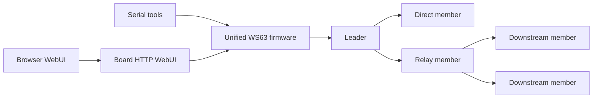

# sle_mesh

[](LICENSE)
[](versions/v4.4.126/VERSION.md)
[](versions/v4.4.126/VERSION.md)
[](xc/ws63_team_network/)
[](webui/)

`sle_mesh` 是面向 WS63 SLE 的团队组网工程，提供统一固件、运行时 leader/member 配置、自适应 relay 中继、板端 HTTP WebUI、浏览器 WebUI、远程 Ubuntu 编译、自动烧录和多板验证工具链。

这个仓库按开源工程方式组织：协议、固件、WebUI、自动化、硬件资料、版本记录和维护文档各自分区，便于复现、审查和继续扩展。

## 当前版本

- 最新仓库记录：`v4.4.126`
- 当前固件版本：`v4.4.126`
- 最新仓库记录说明：[versions/v4.4.126/VERSION.md](versions/v4.4.126/VERSION.md)
- 当前固件记录说明：[versions/v4.4.126/VERSION.md](versions/v4.4.126/VERSION.md)
- 版本索引：[versions/README.md](versions/README.md)

## 项目能力

| 能力 | 当前状态 | 入口 |
| --- | --- | --- |
| 统一固件 | leader/member/relay 使用同一固件包，运行时配置角色 | [firmware/](firmware/) |
| SLE 组网 | member 入队、leader 配对窗口、relay 自适应中继、离队/重连事件 | [include/](include/), [src/](src/) |
| 板端控制台 | SoftAP 自动启动，提供状态、节点、事件、配对和定位上报页面 | [xc/ws63_team_network/](xc/ws63_team_network/) |
| 浏览器 WebUI | 面向调试和批量操作的浏览器端工具 | [webui/](webui/) |
| 远程构建 | 使用 Ubuntu SDK 主机产出 WS63 固件包 | [scripts/build/](scripts/build/) |
| 烧录和串口 | 单板/多板烧录，串口角色配置和状态查询 | [scripts/flash/](scripts/flash/), [scripts/serial/](scripts/serial/) |
| 自动化验证 | Python 单测、协议仿真、WebUI 合同测试、多板编排 | [automation/ws63/](automation/ws63/), [scripts/test/](scripts/test/) |
| 硬件资料 | 原理图、外壳、后续 PCB/Gerber/BOM 归档入口 | [hardware/](hardware/) |

## 系统拓扑



典型四板验证可以让 leader 只保留一个直连名额，其余 member 通过自适应 relay 入队，用来观察 member 重启、relay 重启、relay 接管和原 relay 恢复后的路由行为。

## 快速开始

### 1. 选择运行角色

所有节点使用同一固件。烧录后可通过串口或板端页面配置角色：

```text
cfg status
cfg leader now <team> <channel>
cfg member now <leader_suffix_hex> <team> <channel>
cfg apply
cfg clear
cfg reboot
```

Windows PowerShell 辅助脚本：

```powershell
powershell -ExecutionPolicy Bypass -File scripts/serial/ws63_serial_cfg.ps1 -Port COM16 -Mode leader -Team 7 -Channel 33
powershell -ExecutionPolicy Bypass -File scripts/serial/ws63_serial_cfg.ps1 -Port COM13 -Mode member -LeaderSuffix 9A2F -Team 7 -Channel 33
powershell -ExecutionPolicy Bypass -File scripts/serial/ws63_serial_cfg.ps1 -Port COM13 -Mode status
```

### 2. 打开板端 WebUI

默认板端 Wi-Fi：

```text
SSID: SLE-TEAM-V4-XXXX
Password: 123456789
URL: http://192.168.43.1/
```

常用页面：

| 页面 | 用途 |
| --- | --- |
| `/` | 状态总览 |
| `/nodes` | 已入队节点 |
| `/events` | 最近收发事件 |
| `/pairing` | 角色选择、leader 配队、member 选择 leader、手机定位上报 |

### 3. 远程编译

推荐使用远程 Ubuntu 编译机：

```sh
UBUNTU_HOST=192.168.6.5 \
UBUNTU_USER=owen \
UBUNTU_PASS='<set locally, do not commit secrets>' \
UBUNTU_SDK=/home/owen/workspace/bearpi-pico_h3863 \
BUILD_JOBS=4 \
scripts/build/ws63_build_v4_ubuntu.sh unified
```

统一固件输出：

```text
output_from_vm/team_network_v4_unified_runtime_role/ws63-liteos-app_v4_unified_all.fwpkg
```

## 烧录

单板烧录：

```sh
WS63_FLASH_NO_CONFIRM=1 scripts/flash/ws63_flash_team.sh --yes unified /dev/tty.usbserial-10
```

Windows 多串口烧录：

```powershell
powershell -NoProfile -ExecutionPolicy Bypass -File scripts/flash/ws63_flash_multi.ps1 `
  -Ports COM16,COM13,COM17,COM18 `
  -Parallel `
  -Firmware output_from_vm\team_network_v4_unified_runtime_role\ws63-liteos-app_v4_unified_all.fwpkg `
  -ExpectedVersion v4.4.126
```

自动烧录工具：

```powershell
python automation\ws63\tools\ws63_auto_burn.py `
  -p COM16 `
  -b 115200 `
  --software-reset-only `
  --reset-command reboot `
  output_from_vm\team_network_v4_unified_runtime_role\ws63-liteos-app_v4_unified_all.fwpkg
```

## HTTP API

| API | 用途 |
| --- | --- |
| `GET /api/status` | 板端状态 |
| `GET /api/nodes` | 节点列表 |
| `GET /api/events` | 最近事件 |
| `GET /api/pending` | 待批准成员 |
| `GET /api/location?lat=...&lon=...&dst=255&speed=...&heading=...&battery=...&fix=...&sat=...` | 手机定位上报 |
| `GET /api/config/status` | 当前运行配置 |
| `GET /api/config/leader?team=1&channel=17&now=1` | 配置 leader |
| `GET /api/config/member?leader=C7E9&team=1&channel=17&now=1` | 配置 member |
| `GET /api/config/apply` | 应用配置 |
| `GET /api/config/clear` | 清理配置 |
| `GET /api/config/reboot` | 重启 |
| `GET /api/pairing?action=start\|stop\|approve&id=...&relay=0\|1` | 配对控制 |
| `GET /api/member/select?team=...&leader=...&channel=...` | member 选择 leader |
| `GET /api/member/leave` | member 主动离队 |
| `GET /api/factory-reset` | 恢复配置 |

完整合同见 [webui/shared/ws63-api.json](webui/shared/ws63-api.json)。

## 验证

常用验证入口：

```sh
python -m unittest discover -s automation/ws63/tests -t .
python -m unittest tools.test_sle_team_python_sim
scripts/sim/simulate_v2.sh --suite=python --stress=1
npm --prefix webui test
npm --prefix webui run build
git diff --check
```

本地 C smoke test：

```sh
cc -Wall -Wextra -Werror -Iinclude -DSLE_TEAM_NETWORK_TEST \
  examples/team_network_demo.c src/sle_team_node.c src/sle_team_packet.c src/sle_team_web_api.c \
  -o /tmp/sle_team_network_test && /tmp/sle_team_network_test

cc -Wall -Wextra -Werror -Iinclude -DSLE_TEAM_PACKET_TEST \
  examples/team_node_common.c src/sle_team_packet.c \
  -o /tmp/sle_team_packet_test && /tmp/sle_team_packet_test
```

## 仓库结构

| 目录 | 用途 |
| --- | --- |
| [firmware/](firmware/) | 固件工程索引和固件版本边界说明 |
| [xc/ws63_team_network/](xc/ws63_team_network/) | WS63 板端固件工程 |
| [include/](include/), [src/](src/) | SLE team 协议、状态机、CLI 和 Web API 共享代码 |
| [examples/](examples/) | 本地 C 回归和演示程序 |
| [scripts/](scripts/) | 构建、烧录、串口、仿真、测试和审查脚本 |
| [automation/ws63/](automation/ws63/) | WS63 自动化工具、串口预检和多板测试 |
| [webui/](webui/) | 浏览器 WebUI |
| [hardware/](hardware/) | PCB、原理图、3D 打印外壳和制造资料 |
| [versions/](versions/) | 仓库、固件、硬件版本记录和验证记录 |
| [docs/](docs/) | 阶段文档和维护说明 |

更完整的目录说明见 [docs/repository_layout.md](docs/repository_layout.md)。

## 硬件资料

- 硬件入口：[hardware/README.md](hardware/README.md)
- 当前 3D 打印外壳：[hardware/enclosures/sle-pcb-enclosure/v1.1.4/](hardware/enclosures/sle-pcb-enclosure/v1.1.4/)
- 当前原理图参考：[hardware/schematics/sle-main-board/v0.1/](hardware/schematics/sle-main-board/v0.1/)
- PCB、Gerber、BOM、原理图等公开资料应放入 `hardware/boards/` 或 `hardware/schematics/` 的对应版本目录。

## 版本与维护

- 仓库、固件和硬件版本规则见 [docs/version_management.md](docs/version_management.md)。
- 固件行为变化时更新固件版本和 `versions/<version>/`。
- 仅文档、目录或脚本布局变化时，更新仓库记录版本，不冒充固件升级。
- 构建产物、日志、本地草稿和临时模型不提交到 Git。

## 参与协作

建议从这些入口开始：

- 先读 [docs/branch_strategy.md](docs/branch_strategy.md)，选择匹配目标的长期分支。
- 行为变更先补测试，再更新对应版本记录。
- WebUI/HTTP 合同变化同步更新 [webui/shared/ws63-api.json](webui/shared/ws63-api.json) 和相关测试。
- 硬件资料按版本目录归档，避免散落在仓库根目录。

## License

Apache-2.0. See [LICENSE](LICENSE).
