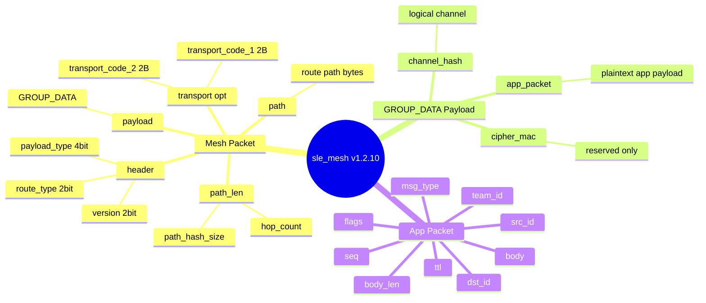

# 包结构和字段含义

## 思维图



## 完整层级

```text
+-------------------- Mesh Packet --------------------+
| header | transport(opt) | path_len | path | payload |
+-----------------------------------------------------+
                                                |
                                                v
+------------------- GROUP_DATA Payload -------------------+
| channel_hash(1) | cipher_mac(2) | app_packet(variable)   |
+----------------------------------------------------------+
                                                |
                                                v
+---------------------- App Packet ------------------------+
| msg_type | flags | seq | team_id | src | dst | ttl | len |
| body...                                                  |
+----------------------------------------------------------+
```

## Mesh Packet

对应结构体：

- `sle_team_mesh_packet_t`

编码/解码函数：

- `sle_team_encode_mesh_packet()`
- `sle_team_decode_mesh_packet()`

### header

`header` 是 1 字节：

```text
bit7 bit6 | bit5 bit4 bit3 bit2 | bit1 bit0
 version  |     payload_type     | route_type
```

构造代码：

```c
header = ((version & 0x03) << 6) |
         ((payload_type & 0x0F) << 2) |
         (route_type & 0x03);
```

字段含义：

- `version`：外层协议版本，当前为 `0`
- `payload_type`：payload 类型，当前主要使用 `GROUP_DATA = 0x06`
- `route_type`：路由方式，当前常用 `DIRECT` 和 `FLOOD`（relay 转发仍复用该层封装）

### transport(opt)

可选字段，仅在下面两种路由类型出现：

- `SLE_TEAM_ROUTE_TRANSPORT_FLOOD`
- `SLE_TEAM_ROUTE_TRANSPORT_DIRECT`

长度：

```text
transport_code_1: 2 bytes little-endian
transport_code_2: 2 bytes little-endian
```

当前项目第一阶段基本不使用它。

### path_len

`path_len` 是 1 字节压缩字段：

```text
bit7 bit6 | bit5 bit4 bit3 bit2 bit1 bit0
hash_size |           hop_count
```

含义：

- 高 2 位：`path_hash_size - 1`
- 低 6 位：`hop_count`

### path

长度：

```text
path_bytes = path_hash_size * hop_count
```

当前实现主要通过连接路由表做转发，`path` 字段通常为空。

### payload

当前 payload 固定承载 `GROUP_DATA Payload`。

## GROUP_DATA Payload

对应函数：

- `sle_team_wrap_mesh_group_data()`
- `sle_team_unwrap_mesh_group_data()`

结构：

```text
offset 0: channel_hash    1 byte
offset 1: cipher_mac[0]   1 byte
offset 2: cipher_mac[1]   1 byte
offset 3: app_packet      variable
```

字段含义：

- `channel_hash`：逻辑信道标识，当前默认 `0x11`
- `cipher_mac`：当前仅占位，没有安全语义
- `app_packet`：当前明文业务包

## App Packet

对应结构体：

- `sle_team_app_packet_t`

结构：

```text
offset 0  : msg_type      1 byte
offset 1  : flags         1 byte
offset 2  : seq low       1 byte
offset 3  : seq high      1 byte
offset 4  : team_id       1 byte
offset 5  : src_id        1 byte
offset 6  : dst_id        1 byte
offset 7  : ttl           1 byte
offset 8  : body_len low  1 byte
offset 9  : body_len high 1 byte
offset 10+: body          variable
```

字段含义：

- `msg_type`：业务消息类型
- `flags`：预留标志位，当前为 `0`
- `seq`：消息序号，小端
- `team_id`：队伍编号
- `src_id`：源节点 ID
- `dst_id`：目标节点 ID，广播为 `0xFF`
- `ttl`：跳数控制，多跳 relay 转发时会递减，`ttl<=1` 时丢弃
- `body_len`：body 长度，小端
- `body`：具体业务体

当前消息类型（`app_msg_type`）：

```text
0x01 HELLO
0x02 HEARTBEAT
0x03 POS_REPORT
0x04 ALERT
0x05 CONFIG
0x06 ACK
0x07 ROUTE_UPDATE
```

## 示例包

测试输出：

```text
1A 00 11 00 00 03 00 01 00 01 02 01 01 10 00 68 F4 60 02 48 14 F0 06 78 00 5A 00 58 01 09 00
```

拆解：

- `[0] 1A`：`version=0`，`payload_type=GROUP_DATA`，`route_type=DIRECT`
- `[1] 00`：`path_hash_size=1`，`hop_count=0`
- `[2] 11`：`channel_hash=0x11`
- `[3..4] 00 00`：`cipher_mac` 占位
- `[5] 03`：`msg_type=POS_REPORT`
- `[7..8] 01 00`：`seq=1`
- `[9] 01`：`team_id=1`
- `[10] 02`：`src_id=2`
- `[11] 01`：`dst_id=1`
- `[13..14] 10 00`：`body_len=16`

## 加密状态

当前应用层没有端到端加密；`cipher_mac` 仍是占位字段。
是否有空口链路加密取决于 SLE 底层安全配对配置（SDK 层）。

当前实际结构是：

```text
[channel_hash][00 00][plaintext app_packet]
```

未来加密版本应改为：

```text
[channel_hash][real_mac][ciphertext]
```
